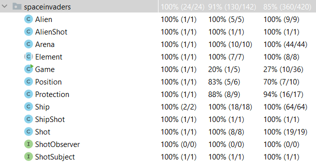
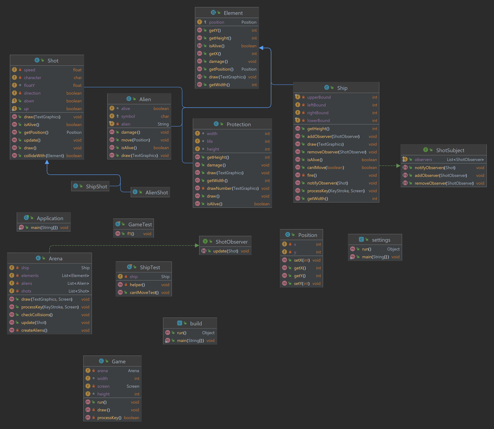

## LDTS_l01g06 - Space Invaders

Space Invaders is a fixed shooter in which the player moves a laser cannon horizontally across the bottom of the screen and fires at aliens overhead.
The aliens progressively move towards the bottom of screen.
The goal is to eliminate all the aliens by shooting them. While the player has three lives, the game ends immediately if the invaders reach the bottom of the screen.
The aliens attempt to destroy the player's cannon by firing projectiles.

This project was developed by *João Tomás Teixeira* (*up202108738*@edu.fe.up.pt), *Pedro Lima* (*up202108806*@edu.fe.up.pt) and *Pedro Januário* (*up202108768*@edu.fe.up.pt) for LDTS 2022/23.

### IMPLEMENTED FEATURES

The player controls the ship and only the ship.
We have implemented the ship's capacity to move itself to the right or to the left (within the limits of the window/arena) in the bottom of the window and to fire shots.
The player can move the ship left pressing the 'A' key or the left arrow key, move the ship right pressing the 'D' key or the right arrow key and fire a shot
pressing space or the up arrow key.
In the top of the window, our game draws 50 aliens (shown as the chars X, Y and &). Each alien dies (and disappears) when it's hit by a shot fired by the ship.
We have also implemented three protections that will act as a shield of the ship. They have their own number of lives, which is decremented when hit by a shot fired
by anyone (the ship or an alien, although the aliens are not firing yet). They disappear when their lives reach 0. This feature can be tested by shooting at them.

**Arena**:

- **CreateAliens** - Creates three different types of aliens arranged by five rows of ten aliens.
- **CheckCollisions** - Checks if a shot hit an element.
- **ProcessKey** - Receives an input from the user, if it is the "q" key the game screen closes.

**Element**:

- **Draw** - Draws the arena where the game will be played and calls specific draw methods to all its elements including the aliens, the ship, the shots and the protections.
- **Damage and isAlive method** - Takes some amount of life from the element and subsequently checks if it is still alive.

**Position**:

- **Position methods** - Several methods to set and get a position of an element.

**Ship**:

- **UpdateShots** - Updates the list where the shots are stored whenever the ship fires.
- **canIMove** - Verifies if an element can move or if it already hit the walls (his limits).
- **ShipShot** - Creates a new shot fired by the ship.
- **ProcessKey** - Receives an input from the user. If it is the right arrow the ship moves to the right and the opposite for the left arrow and finally when the up arrow is pressed the ship shoots.

**Protection**:

- **DrawNumber** - Draws the life of the protections.

Fig.1 - Beginning of the Game

Fig.2 - Middle of the Game

### PLANNED FEATURES

- **Moving aliens** - The aliens shall move together to one side of the screen (continuously, one side or the other) and slowly be moving towards the bottom of 
the screen. If they reach it, the player shall lose.
- **Shooting aliens** - The aliens shall fire shots at the ship randomly.
- **Score** - The game shall count the player's score and store it in a file which will be read when the user wants to view the highest scores.
- **User Menu** - When the game starts, the user shall be presented a menu with the option to play, to view the highest scores and to quit the game.
- **Lives** - The ship shall have 3 lives and lose one whenever it's hit by an alien's shot. The player shall lose the game when the ship's lives reach 0.
- **Make the user always press a key to move the ship** - The player shall be forced to always press a key to make the ship move one position, instead of pressing it continuously to move the ship in the same direction.

Fig. 3 - Main Menu mockup

Fig. 4 - Mockup of the in-game lives and score features

Fig. 5 - Mockup of the highest scores feature.

### DESIGN
#### OBSERVATER PATTERN
- **Problem in Context.** - We needed a way to communicate to [ArenaModel](../src/main/java/spaceinvaders/model/ArenaModel.java) that the [ship has fired a shot](https://github.com/FEUP-LDTS-2022/project-l01gr06/blob/70c3ae42ed8ec87b2767c2d0a6b8ab4207517a21/src/main/java/spaceinvaders/Ship.java#L93-L95), so [ArenaViewer](../src/main/java/spaceinvaders/view/ArenaViewer.java) could draw it.
- **The Pattern** - Observer Pattern
- **Implementation.** - The [ShipModel](../src/main/java/spaceinvaders/model/ShipModel.java) is the subject, so it implements the [ShotSubjectModel](../src/main/java/spaceinvaders/model/ShotSubjectModel.java) interface, and the [ArenaModel](../src/main/java/spaceinvaders/model/ArenaModel.java) is the observer, so it implements the [ShotObserverModel](../src/main/java/spaceinvaders/model/ShotObserverModel.java) interface. The ShotSubject, and subsequently the [ShipModel](../src/main/java/spaceinvaders/model/ShipModel.java), has a [list of Observers](https://github.com/FEUP-LDTS-2022/project-l01gr06/blob/70c3ae42ed8ec87b2767c2d0a6b8ab4207517a21/src/main/java/spaceinvaders/ShotSubject.java#L6) and whenever it fires a shot, it notifies all the [Observers](../src/main/java/spaceinvaders/model/ShotObserverModel.java), including [ArenaModel](../src/main/java/spaceinvaders/model/ArenaModel.java). You can see this in the following UML.
- **Consequences.** - The consequence of this design is that the [ShipModel](../src/main/java/spaceinvaders/model/ShipModel.java) doesn't need to know anything about the [ArenaModel](../src/main/java/spaceinvaders/ArenaModel.java), and the [ArenaModel](../src/main/java/spaceinvaders/model/ArenaModel.java) doesn't need to know anything about the [ShipModel](../src/main/java/spaceinvaders/model/ShipModel.java). This is a good design because it makes the code more modular and easier to understand.

Fig. 6 - Observer Pattern UML

#### COMPOSITE PATTERN
- **Problem in Context.** - We started by working with the 50 aliens directly from the [ArenaModel](../src/main/java/spaceinvaders/model/ArenaModel.java), but any time we added a new feature it became harder to work with.
- **The Pattern** - Composite Pattern
- **Implementation.** - We joined all the aliens into a single element called AlienGroup  (corresponding to the classes [AlienGroupModel](../src/main/java/spaceinvaders/model/AlienGroupModel.java) and [AlienGroupViewer](../src/main/java/spaceinvaders/view/AlienGroupViewer.java)). The class [AlienGroupModel](../src/main/java/spaceinvaders/model/AlienGroupModel.java) extends the class [ElementModel](../src/main/java/spaceinvaders/model/ElementModel.java) and has a list of [Aliens](../src/main/java/spaceinvaders/model/AlienModel.java) that stores all aliens in the game, which in turn also extend the class [ElementModel](../src/main/java/spaceinvaders/model/ElementModel.java).
- **Consequences.** - It becomes easier to work with the aliens, since we can now work with the AlienGroup, which has all the aliens. This is a good design because it makes the code more modular and easier to understand. In particular, it becomes much easier to draw and add new features to the aliens.

#### STATE PATTERN
- **Problem in Context.** - We needed to change the state of the [Game](../src/main/java/spaceinvaders/model/GameModel.java), from the [Main Menu](../src/main/java/spaceinvaders/model/menu/MainMenuModel.java) to the game itself or from the main menu to the [other menus](../src/main/java/spaceinvaders/model/menu).
- **The Pattern** - State Pattern
- **Implementation.** - The class [GameModel](../src/main/java/spaceinvaders/model/GameModel.java) has a variable [state](https://github.com/FEUP-LDTS-2022/project-l01gr06/blob/c0690bfd418efcde9a68d979afc54693e1da76a5/src/main/java/spaceinvaders/model/GameModel.java#L14) of type [RunStateModel](../src/main/java/spaceinvaders/model/RunStateModel.java), which holds the current [state](https://github.com/FEUP-LDTS-2022/project-l01gr06/blob/c0690bfd418efcde9a68d979afc54693e1da76a5/src/main/java/spaceinvaders/model/GameModel.java#L14) of the Game. We've also implemented a [MenuStateModel](../src/main/java/spaceinvaders/model/menu/MenuStateModel.java) and an [ArenaStateModel](../src/main/java/spaceinvaders/model/ArenaStateModel.java), both implement the interface [RunStateModel](../src/main/java/spaceinvaders/model/RunStateModel.java) and store a Model, a Controller and a [RunStateViewer](../src/main/java/spaceinvaders/view/RunStateViewer.java) (respectively [MenuStateViewer](../src/main/java/spaceinvaders/view/menu/MenuStateViewer.java) and [ArenaStateViewer](../src/main/java/spaceinvaders/view/ArenaStateViewer.java)), which in turn was a [Viewer](../src/main/java/spaceinvaders/view/Viewer.java). In every frame the game [runs](https://github.com/FEUP-LDTS-2022/project-l01gr06/blob/c0690bfd418efcde9a68d979afc54693e1da76a5/src/main/java/spaceinvaders/model/RunStateModel.java#L7), [draws](https://github.com/FEUP-LDTS-2022/project-l01gr06/blob/c0690bfd418efcde9a68d979afc54693e1da76a5/src/main/java/spaceinvaders/view/RunStateViewer.java#L6) and [processes keys](https://github.com/FEUP-LDTS-2022/project-l01gr06/blob/c0690bfd418efcde9a68d979afc54693e1da76a5/src/main/java/spaceinvaders/controller/Controller.java#L6) through the current [state](https://github.com/FEUP-LDTS-2022/project-l01gr06/blob/c0690bfd418efcde9a68d979afc54693e1da76a5/src/main/java/spaceinvaders/model/GameModel.java#L14) stored in the [GameModel](../src/main/java/spaceinvaders/model/GameModel.java).
- **Consequences.** - As every time we change the [state](https://github.com/FEUP-LDTS-2022/project-l01gr06/blob/c0690bfd418efcde9a68d979afc54693e1da76a5/src/main/java/spaceinvaders/model/GameModel.java#L14) of the game, its behavior changes completely, so it becomes much easier to have a different class to handle each state.

### REFACTORING(anotations)
- Large Class -> Extract Class
In the intermediary delivery we haven't implemented MVC, so we needed to extract a class viewer and a class controller from each class, then renamed the original class to clas model.
The class Element, Alien, AlienShot, ShipShot, Shot and Protection generated a Model and a Viewer.
The class Ship, Arena and Game generated a Model, a Viewer and a Controller.
The rest didn't need to be refactored.

- Large Class -> Extract Class
We extracted the method createAliens from the class ArenaModel to the class AlienGroupModel.

#### KNOWN CODE SMELLS AND REFACTORING SUGGESTIONS
#### LARGE CLASS
In the intermediary delivery we hadn't implemented MVC, so we had classes that did more than did the work of three(Model, Controller and Viewer).
So we extracted a class viewer and a class controller from each class, by extracting to these classes the methods that did this job, then renamed the original class to class model.
The class `Ship`, `Arena` and `Game` generated a Model, a Viewer and a Controller.
The class `Element`, `Alien`, `AlienShot`, `ShipShot`, `Shot` and `Protection` only generated a Model and a Viewer.
The rest didn't need to be refactored.

#### DUPLICATE CODE
In the class `Ship` we had methods that did the same thing, but with different names, so we removed one of them and changed all the references of the deleted one.
The methods `decreaseLives` and `damage` did the same thing, so we removed the method `decreaseLives`.
The method `died` and `isAlive` did almost the same thing, so we removed the method `died` and changed all the references of that method to `!isAlive()`.

#### PULL UP METHOD
In the subclasses of `Element` we had methods common to almost all of them, so we pulled up the methods to the superclass `Element`.
This were ...

#### DEAD CODE
We had various methods and classes that were no longer used, so we deleted them.
The classes `DummyCommad`, `NullController` and `LifeModel` were only used so the code could compile without errors, so when we finished the game we deleted them.
The method `getScore` in the class `AlienGroupModel`, .

------

### TESTING

Fig. 7 - Coverage Report

- Link to mutation testing report.

### SELF-EVALUATION

> In this section describe how the work regarding the project was divided between the students. In the event that members of the group do not agree on a work distribution, the group should send an email to the teacher explaining the disagreement.

- John Doe: 40%
- Jane Doe: 60%

### UML DIAGRAM

